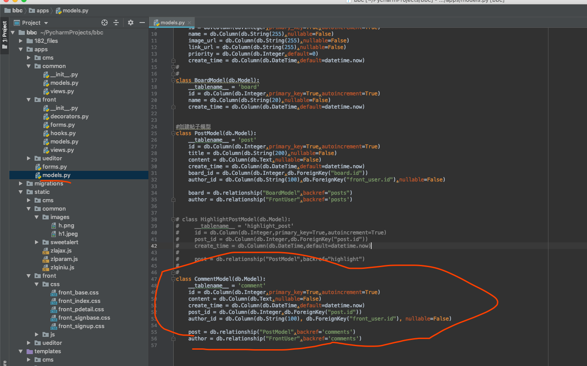
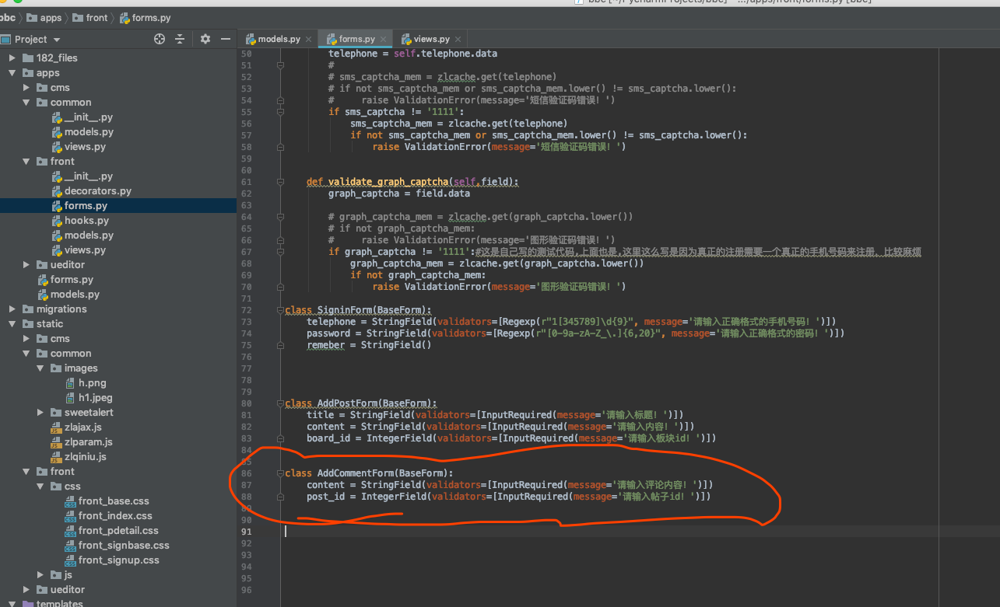
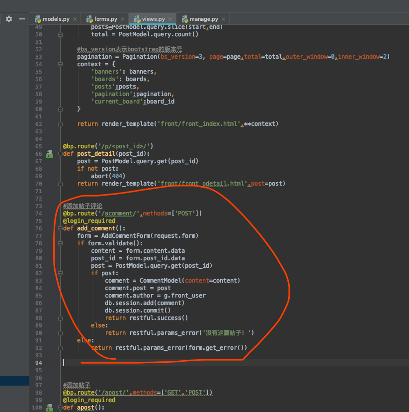
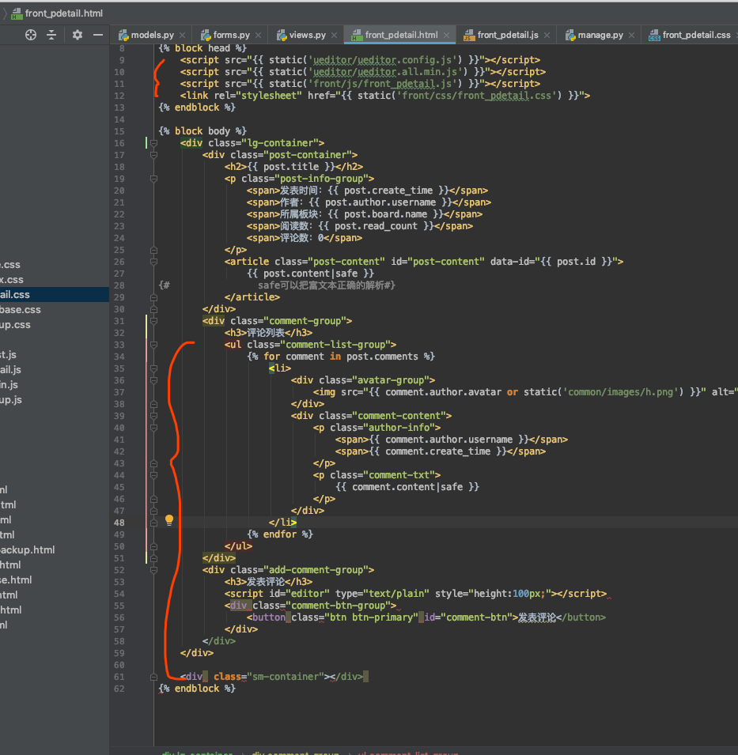

[TOC]




```
(my_env) $python3 manage.py db migrate
INFO [alembic.runtime.migration] Context impl MySQLImpl.
INFO [alembic.runtime.migration] Will assume non-transactional DDL.
INFO [alembic.autogenerate.compare] Detected added table 'comment'
  Generating /Users/mac/PycharmProjects/bbc/migrations/versions/6d63cee9a614_.py
  ... done
(my_env) $python3 manage.py db upgrade
INFO [alembic.runtime.migration] Context impl MySQLImpl.
INFO [alembic.runtime.migration] Will assume non-transactional DDL.
INFO [alembic.runtime.migration] Running upgrade c5b238cda56e -> 6d63cee9a614, empty message
(my_env) $
```







